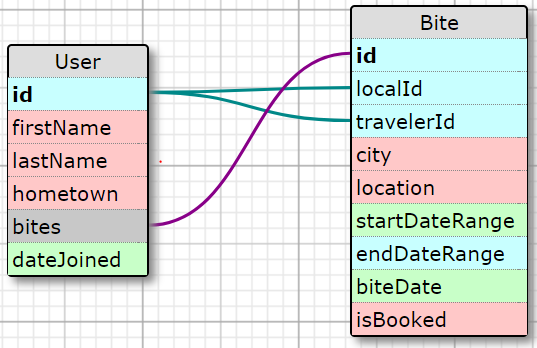

# Chews

## The Pitch
### HOW MIGHT WE...

> *Personalize travelers' dining experience and humanize local cultures, by allowing travelers to connect and schedule meals with local foodies*

## App Functionalities
1. Secure Login 
2. User Profile
3. Create & Book 'Bites'
4. Live In-app Messaging

## Roles
* Andrew Huang: Front End Developer
* Ali Arfeen: Front End Developer
* Nicole Ersing: Back End Developer
* Imran Kazmi: Back End Developer

## Tools and Technologies
The application was built in the MERN stack. In the front end we worked with React, Material-UI, and styled-components. In the back end, we used Mongo DB with Mongoose ODM, Node, and Express. For secure login we used Auth0. For live messaging, we used Socket.io.

## Looking Forward
There are a number of functionalities we were unable to implement within the time constraints of the project.
1. _Google Places API_. Implement autofill. Display restaurant locations on a map in a Bite's details.
2. _User Ratings_. Give Locals and Travelers the ability to rate each other, on a point system of 'snaps'.
3. _Local Approve/Decline Travelers_. Give locals the ability to choose one traveler to grab a bite with from a list of requests.
4. _Add Tags/Labels to Listings_. Make Bites more searchable/filterable, and more descriptive. (ie. type of cuisine, alcohol-friendly, family-friendly)

## Links
* [Trello Board](https://trello.com/b/9010LArh/project-3)
* [GitHub Repository](https://github.com/youknowme786/Chews )
* [Live on Heroku](https://chewsapp.herokuapp.com)
* [WireFrame](https://projects.invisionapp.com/freehand/document/bLDFwK0b8)
